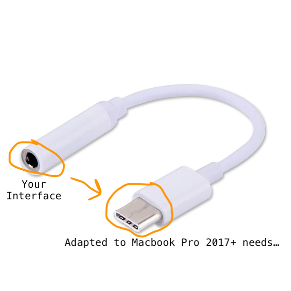

## Intro
In this post, we'll introduce another popular design pattern - Adapter. Adapters are common in everyday life, so you should have an idea what it comes down to. If not, take a quick look at the image below:   

So, as you can see in the picture, the purpose of the adapter is to take one interface and make it compatible with another. In programming, its purpose is exactly the same - you'll want to use this pattern when you have some type/class and you want to make it compatible with another.

## How to do the trick?

In Java, this is done by creating an Adapter class, which extends the type we target (our desired interface) and stores a reference to Adaptee (object of type that needs to be adapted).

#### Elements of pattern
- Target - our desired type
- Adaptee - type that needs to be adapted
- Adapter - class that makes Adaptee compatible with Target

#### Relations between components
The client of our code invokes Adapter methods, which are compatible with Target interface/type, but underneath are delegated to Adaptee object.

#### Code example
If you still have difficulties understanding the purpose of this pattern, looking at some code should definitely help.

First, let's declare the interface that we target (the one that we want our adapted object to be compatible with)
```java
interface Target {
    String getFirstName();
    String getLastName();
}
```
Now, we're adding class that will be adapted (the one incompatible with Target interface)
```java
class Adaptee {
    String getFullName() {
        return "Patryk Jeziorowski";
    }
}
```
As you can see, interfaces of Target and Adaptee differs. Let's fix it with Adapter.
```java
public class Adapter implements Target {

    private final Adaptee adaptee = new Adaptee();

    @Override
    public String getFirstName() {
        return adaptee.getFullName().split(" ")[0]; // just a dumb example impl
    }

    @Override
    public String getLastName() {
        return adaptee.getFullName().split(" ")[1]; // just a dumb example impl
    }

}
```
The Adapter is compatible with Target interface by implementing it, and under the hood it delegates
the work to Adaptee object. This allows us to reuse Adaptee implementation anywhere we need object of Target type.

At the end, let's take a look at some client that may use our classes:
```java
public class ClientCode {
    public static void main(String[] args) {
        final Target target = new Adapter();
        System.out.println(target.getFirstName());
        System.out.println(target.getLastName());
        // output:
        // Patryk
        // Jeziorowski
    }
}
```
Anywhere the Target type is needed, the client can use Adapter instead, which delegates the hard work to Adaptee.
```java
    final Target target = new Adapter();
```
```java
// Adapter impl
    @Override
    public String getFirstName() {
        // use adaptee
        return adaptee.getFullName().split(" ")[0]; // just a dumb example impl
    }
```