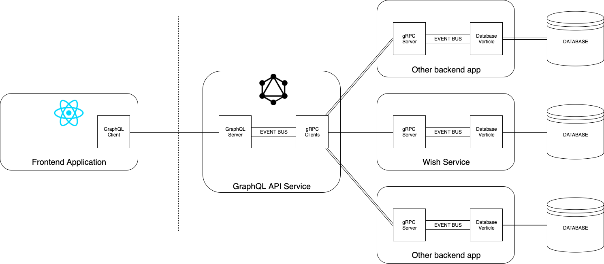
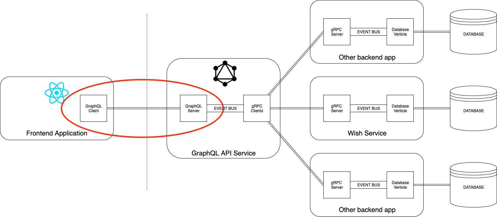
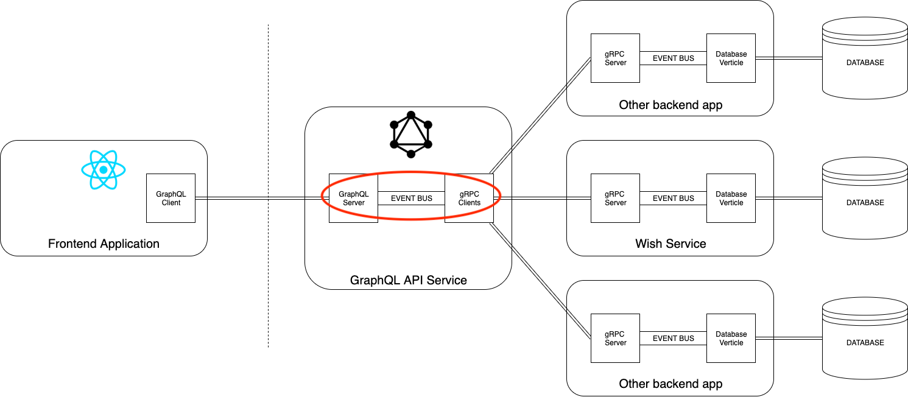
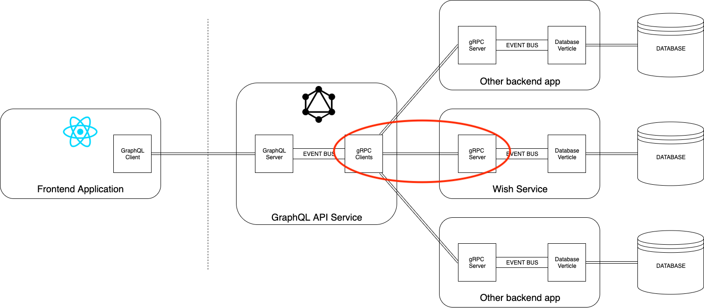
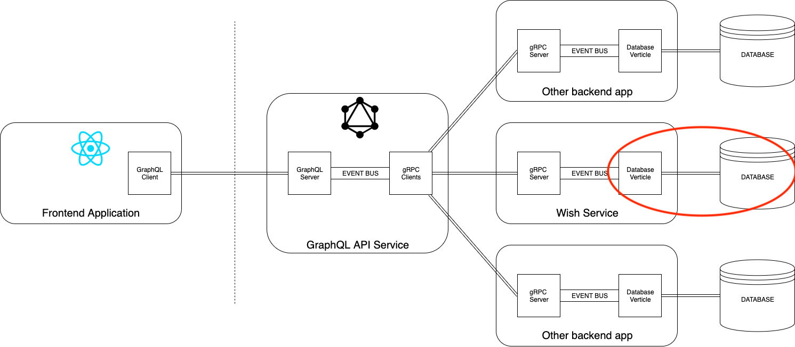
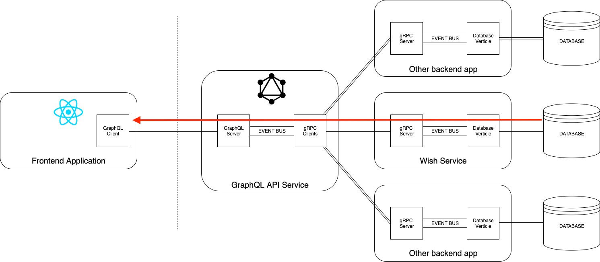

Hello everyone! In this post, I'll explain how Vert.x, gRPC and GraphQL is used in [Appwish project](https://github.com/appwish) to provide APIs for UI applications.
We'll use two backend microservices as an example - [graphqlapi](https://github.com/appwish/graphqlapi) and [wishservice](https://github.com/appwish/wishservice).

If you're unfamiliar with Appwish, it's an open-source project that I started two weeks ago in [this dev.to post](https://dev.to/pjeziorowski/react-reactive-microservices-kubernetes-graphql-grpc-announcing-appwish-fullstack-tutorial-series-opensource-project-10c0).
It was supposed to be a kind of tutorial, but after over 130 people joined me on [Slack](https://join.slack.com/t/appwish/shared_invite/enQtODk4MTgzOTMwMjg4LWUwZGFlNjQ5ZWZiMzIyYWRmYjA1NDgyMzVlMjIxNzc4NTU0NmUyMWIzYzgyNzk0YjVlMDkzMjZjMmUzYmQyMTg) I decided to switch the focus to building an open-source community
with the goal of releasing a real-world platform that is fully open-sourced and community-driven.

### To learn the dataflow in Appwish let's first take a look at the diagram:



The diagram shows the dataflow and interactions between components in Appwish.

Let's discuss how it goes from the UI up to the database.

### It all started in the frontend
UI, using a GraphQL client, sends a GraphQL query that hits our first backend microservice - [GraphQL API](https://github.com/appwish/graphqlapi).

This part is marked in the picture below:



To send GraphQL queries, the client needs to know the GraphQL schema, which is declared in [.graphqls files](https://github.com/appwish/graphqlapi/tree/master/src/main/resources/schema).
The GraphQL server parses those files and uses them as a contract - contract for UI - backend communication.

Let's supppose that the client sent this query:
```
query {
 wish(id: 123) {
 title
 content
 rating
 }
}
```

In this case, the GraphQL server has to return the data that the UI asked for (title, content and rating of a wish with id=123)

### It can't do it on its own
Even though the schema is created, the GraphQL server won't be able to provide the data UI asks.
It doesn't know how! You need to connect the schema to some executable code that is able to get required data or execute appropriate business logic.


In other words, all operations that are declared in the GraphQL schema need to be associated with code that can deliver
required data.

This is done by so-called [RuntimeWirings and DataFetchers](https://www.graphql-java.com/documentation/v11/schema/). A RuntimeWiring associates one of GraphQL types e.g.
a "Query wish" with a DataFetcher (simply - some code that can fetch wish data).

Here's an [example](https://github.com/appwish/graphqlapi/blob/master/src/main/java/io/appwish/graphqlapi/graphql/wiring/WishTypeRuntimeWiring.java) of wiring GraphQL types related to wishes with DataFetchers in our GraphQL server application.

After we provide RuntimeWirings and DataFetchers, the GraphQL server will know how to deliver the required data. 

### Let's discuss how we implement DataFetchers then.

As you probably already know, Appwish use [Vert.x](https://vertx.io/) as a main backend framework and [gRPC](https://grpc.io/) for service-to-service communication.
One of core Vert.x components is the [Event Bus](https://vertx.io/docs/apidocs/io/vertx/core/eventbus/EventBus.html). Event Bus can be used as a communication channel between various parts of the application.
It can be even used to communicate with other apps, but in Appwish we don't use this feature - we use gRPC to talk to other backend
applications. The Event Bus is used only for internal communication inside applications.

To fetch the data about wishes, the DataFetcher must talk to another service - the wishservice. Wishservice is responsible for
managing wish data and related business logic.

To do so, it must use a gRPC request. But as you can see [here](https://github.com/appwish/graphqlapi/blob/master/src/main/java/io/appwish/graphqlapi/graphql/fetcher/WishFetcher.java),
WishFetcher does not use gRPC. Instead, it sends events on the event bus. "Gimme data about wish id=123!".

This part can be seen in the red circle in the image below:



The DataFetcher sends events on the event bus which are then processed by gRPC Verticle.

[Verticle](https://vertx.io/docs/vertx-core/java/#_verticles) is another important concept of Vert.x. For simplicity, you may think of it as an event loop that
processes events. It's conceptually really similar to Node.js' event loop - it also implements the [Reactor pattern.](https://en.wikipedia.org/wiki/Reactor_pattern)

The gRPC Verticle listens to events sent by DataFetchers and uses gRPC clients to get required data from other microservices.

The part where a gRPC verticle is using gRPC service stub (client) to fetch required data from other microservice
is marked in the picture below:



How does this gRPC communication happen?

In fact, gRPC clients are GENERATED "service stubs". When you use gRPC, by default you also use protobuf. gRPC use protobuf
as underlying message exchange format as well as for its IDL - Interface Definition Language.

We create [.proto files](https://github.com/appwish/graphqlapi/blob/master/src/main/proto/wishservice.proto) that are then used
to generate code in any programming language we want - in this case, Java.

For example, this:

```protobuf
message WishProto {
 int64 id = 1;
 int64 authorId = 2;
 string title = 3;
 string content = 4;
 string url = 5;
 string cover_image_url = 6;
}
```

is used to generate a kind of data transfer object class that holds data we need and is very efficiently serialized
and deserialized for network transfer.

This part:
```
service WishService {
 rpc GetAllWish (AllWishQueryProto) returns (AllWishReplyProto) {
 }
 rpc GetWish (WishQueryProto) returns (WishReplyProto) {
 }
 rpc CreateWish (WishInputProto) returns (WishReplyProto) {
 }
 rpc UpdateWish (UpdateWishInputProto) returns (WishReplyProto) {
 }
 rpc DeleteWish (WishQueryProto) returns (WishDeleteReplyProto) {
 }
}
```

defines the interface to communicate with wish service. All rpc methods have a name, input and output.

Using this declaration, we can generate Java code that is then used for communication with wish service and other
applications.

When we generate source code from service declaration in .proto files we get both - client and server. Wish service use the generated server to serve requests from other apps,
other apps use generated client to send requests.

On the client-side, the generated client (service stub) is all you need to communicate with wish service.
You don't need to implement anything (except of the logic that handles the data we receive from the other application, of course).

You can see the use of generated client [here.](https://github.com/appwish/graphqlapi/blob/master/src/main/java/io/appwish/graphqlapi/grpc/WishGrpcClientService.java).

I'll quickly go through one usage of the stub:

```java
 eventBus.<WishQueryProto>consumer(Address.WISH.get(), event -> {
 stub.getWish(event.body(), grpc -> {
 if (grpc.succeeded()) {
 event.reply(grpc.result());
 } else {
 event.fail(FAILURE_CODE, WISH_SERVICE_COMMUNICATION_ERROR_MESSAGE);
 }
 });
 });
```

The gRPC client service registers an event consumer, that accepts "WishQueries" as an input.
When the event occurs (when DataFetchers request wish data), the code from above is executed.

Stub.getWish() is invoked. Stub is the generated wish service gRPC client, and getWish corresponds
to what we declared in our .proto file:

```proto
 rpc GetWish (WishQueryProto) returns (WishReplyProto) {
 }
```

As you see, we use the WishQueryProt as an input, invoke stub.GetWish() method, and wait for WishReply output.
It exactly matches what we declared in .proto file service definition.

Waiting for the result from another application is asynchronous, so the code that waits for the result is declared as
lambda callback that is invoked when the result arrives:
```java
grpc -> {
 if (grpc.succeeded()) {
 event.reply(grpc.result());
 } else {
 event.fail(FAILURE_CODE, WISH_SERVICE_COMMUNICATION_ERROR_MESSAGE);
 }
 }
```

If the gRPC call succeeded, we send a REPLY on the event bus to the DataFetcher with the gRPC request result (WishReply).
Otherwise, we inform the DataFetcher about the failure.

Okay, that was tough. Our GraphQL query sent from the UI went through the GraphQL server, DataFetcher, gRPC client and now has arrived
in the wish service gRPC server.

### Let's now discuss how gRPC calls are served by the gRPC server

To implement a gRPC server, again, we need to follow what we declared in our .proto file:

```proto
service WishService {
 rpc GetAllWish (AllWishQueryProto) returns (AllWishReplyProto) {
 }
 rpc GetWish (WishQueryProto) returns (WishReplyProto) {
 }
 rpc CreateWish (WishInputProto) returns (WishReplyProto) {
 }
 rpc UpdateWish (UpdateWishInputProto) returns (WishReplyProto) {
 }
 rpc DeleteWish (WishQueryProto) returns (WishDeleteReplyProto) {
 }
}
```

The generated gRPC server has 5 methods that we have to override/implement - GetAllWish, GetWish, CreateWish, UpdateWish and DeleteWish with
their corresponding inputs and outputs (everything according to the .proto file).

All we have to do is to provide implementation for those methods.

In wish service it's done [here.](https://github.com/appwish/wishservice/blob/master/src/main/java/io/appwish/wishservice/service/GrpcServiceImpl.java)

Let's go through one of overriden methods:

```java
 /**
 * This method gets invoked when other service (app, microservice) invokes stub.getWish(...)
 */
 @Override
 public void getWish(final WishQueryProto request, final Promise<WishReplyProto> response) {
 eventBus.<Optional<Wish>>request(
 Address.FIND_ONE_WISH.get(), converter.toDomain(WishQuery.class, request),
 event -> {
 if (event.succeeded() && event.result().body().isPresent()) {
 response.complete(converter.toProtobuf(WishReplyProto.class, new WishReply(event.result().body().get())));
 } else if (event.succeeded()) {
 response.complete();
 } else {
 response.fail(event.cause());
 }
 });
 }
```

As you see, the method name matches what we declared in .proto file. We also get a WishQuery input, and
a Promise of WishReply.

What we have to do is to take the input, talk to the database to fetch the required data and resolve the
WishReply promise.

As we use Vert.x, it's implemented using the Event Bus. We send an event bus request and wait till one of the handlers
responds with what we need.

This part is marked on the image below:


The gRPC server uses the event bus to request wish data. On the second side of event bus there is a Database Verticle
that consumes those requests, talks with the database and responds with the result:



The Database Verticle uses a DatabaseService to register handlers that listens for wish data requests.

[Here's](https://github.com/appwish/wishservice/blob/master/src/main/java/io/appwish/wishservice/service/DatabaseService.java) the implementation of the DatabaseService.

As you see, the event bus handlers are declared as follows:

```java
 public void registerEventBusEventHandlers() {
 eventBus.<AllWishQuery>consumer(Address.FIND_ALL_WISHES.get())
 .handler(event -> wishRepository.findAll(event.body()).setHandler(findAllHandler(event)));

 eventBus.<WishQuery>consumer(Address.FIND_ONE_WISH.get())
 .handler(event -> wishRepository.findOne(event.body()).setHandler(findOneHandler(event)));

 eventBus.<WishInput>consumer(Address.CREATE_ONE_WISH.get())
 .handler(event -> wishRepository.addOne(event.body()).setHandler(addOneHandler(event)));

 eventBus.<UpdateWishInput>consumer(Address.UPDATE_ONE_WISH.get())
 .handler(event -> wishRepository.updateOne(event.body()).setHandler(updateOneHandler(event)));

 eventBus.<WishQuery>consumer(Address.DELETE_ONE_WISH.get())
 .handler(event -> wishRepository.deleteOne(event.body()).setHandler(deleteOneHandler(event)));
 }
```

They consume event bus events with WishQueries/Inputs. When an event occurs, they use wishRepository (code that actually
has database client and logic related to SQL queries) to interact with the database.

The database calls are asynchronous thanks to the [Reactive Vert.x Postgres Client](https://vertx.io/docs/vertx-pg-client/java/).

This is why we set handlers for these asynchronous results of wishRepository methods:

```java
// setHandler to react to async result
wishRepository.findOne(event.body()).setHandler(findOneHandler(event))
```

And the handler simply sends REPLIES to the gRPC Verticle that requested data from the database via the event bus in case of success or notifies about failures in case of errors:
```java
 private Handler<AsyncResult<Optional<Wish>>> updateOneHandler(
 final Message<UpdateWishInput> event) {
 return query -> {
 if (query.succeeded()) {
 event.reply(query.result(), new DeliveryOptions().setCodecName(Codec.WISH.getCodecName()));
 } else {
 event.fail(1, "Error updating the wish in the database");
 }
 };
 }
```

If the whole flow succeeds, the data is returned to the UI that sent the initial GraphQL request



## Conclusions
Okay, that's all I wanted to cover in this post. I hope it gave you a high-level overview of the dataflow
in [Appwish project](https://github.com/appwish). There's so many concepts used that I couldn't cover everything in detail - if you
want to dig deeper you can use links I put in the post, write a comment or ask me a question on [Slack](https://join.slack.com/t/appwish/shared_invite/enQtODk4MTgzOTMwMjg4LWUwZGFlNjQ5ZWZiMzIyYWRmYjA1NDgyMzVlMjIxNzc4NTU0NmUyMWIzYzgyNzk0YjVlMDkzMjZjMmUzYmQyMTg).

### I'd also like to invite you to contribute to the project. 
Everything we do is 100% open-source and transparent. Over 130 people already joined us on Slack. We're slowly starting with the implementation. If you want more information, please read my previous posts, write a comment or join the Slack channel where I give frequent updates about the project status. 