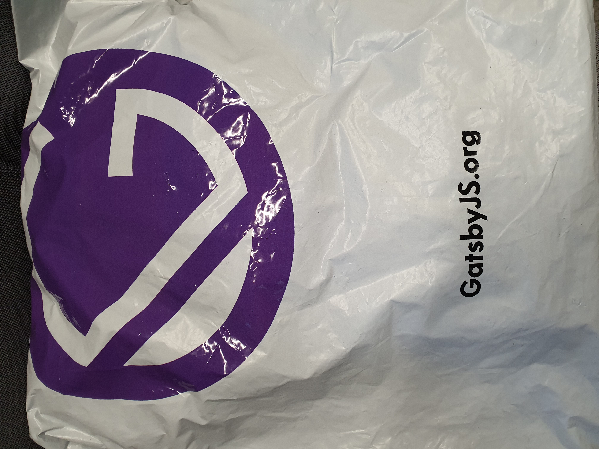
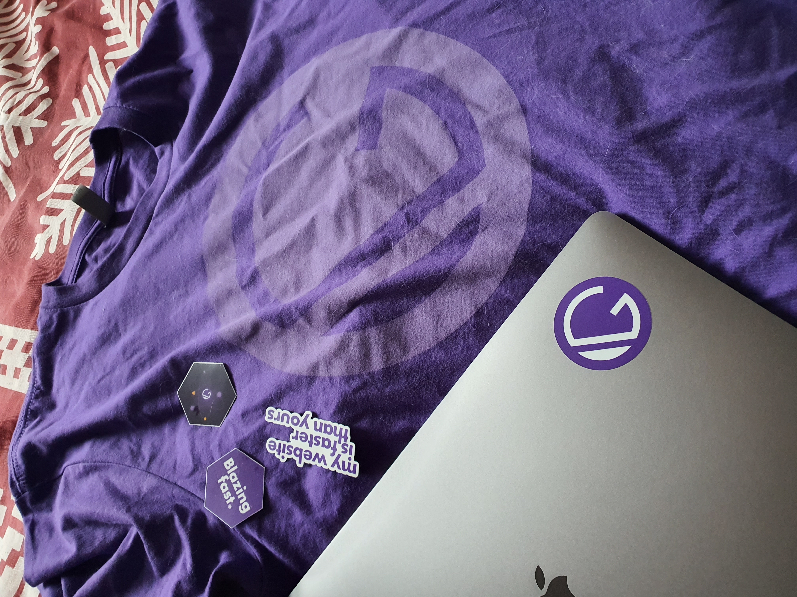
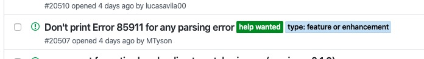
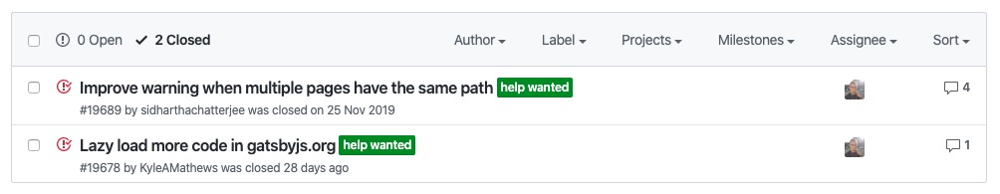

Are you a **React.js** developer who would like to start his/her way with opensource?
Do you want to **learn new things** & **get free SWAG items** - hoodies, t-shirts, stickers and more?

### I have good news for you.

You can get all of the above by contributing to **Gatsby.js** - one of the two most popular frameworks ontop of React. In this post
I'll cover **pros and cons of contributing**, **show you SWAG stuff you can get** and cover **steps you can take to get into open-source**. 

Let's first see what are the results of contributing to open-source projects like Gatsby.

## Pros and cons of contributing

### Pros
- you learn a lot of modern web technologies including: **React.js**, **GraphQL** & **Gatsby**
- you see high quality code in Gatsby repo - **this is a GREAT way to learn good practices** in React projects
- you have a great **open-source activity in your Github profile** which is **attractive to employers**
- you **learn a lot of frontend related stuff** like working with monorepos using lerna and much more
- you'll finally find out that contributing to open-source is not that hard
- last but not least, **you'll be rewarded for your contributions** with hoodies, fancy pants, t-shirts, stickers or whatever you want from the Gatsby store. **First SWAG ships to you after your first merged pull request!**

### Cons
- *you spend your time* **learning effectively** - is it even a disadvantage?

## SWAG Stuff - just received mine

### Hoodie 

### T-Shirt & Stickers

## How to contribute?
Gatsby community is very welcoming and beginner friendly - you can join their discord or even get a pair programming session with one of their core members.

Here's a few ways to start contributing:

### #1
Go to [Gatsby issues](https://github.com/gatsbyjs/gatsby/issues) and look for issues with label **help wanted**:

Very often these issues are created by **core Gatsby members** and outsourced to the community, here's two examples that I found and issued a pull request:

### #2
Play with Gatsby and find out what irritates you. This way you'll expose yourself to learning React, GraphQL and Gatsby at once.

**If you don't know what to build with Gatsby, you can start with coding your own blog** - *this will improve your skills and benefit your programming carrer both*.

**Just think - learning React, GraphQL, Gatsby, contributing to open-source and building your own blog at once?** Sounds very effective!
If you find any bug/inconsistency in Gatsby or even ugly part of UI in some theme, you can open a pull request - it will be reviewed by other contributors and most probably merged.

### #3
Checking other contributors issues - go to [Gatsby issues](https://github.com/gatsbyjs/gatsby/issues) and scan other contributors' tickets. They often do not have any special label
or structure. Sometimes they're just questions, other times they're problems that may involve some quick fixes in Gatsby code. **Either way,
you'll help the community, improve your skills, learn to work in open-source environment + gain your SWAG**.

## Final words
**BTW. I'm just a common user of Gatsby framework, I'm not paid to promote their project or anything - I just love what they do + I love open-source so I had to share this with you, I hope it will benefit you all.**

**May the Open-source be with you! Cheers!**