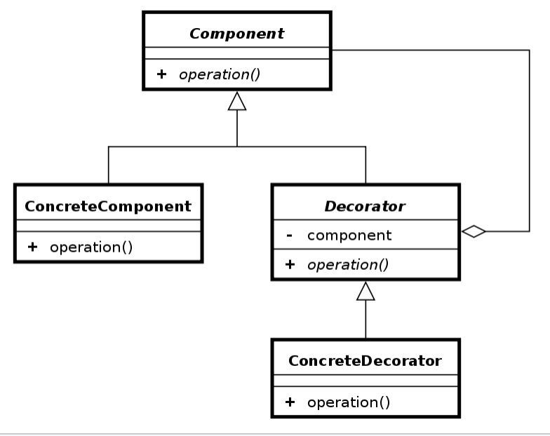

## Introduction

Decorator is another structural design pattern defined by [Gang Of Four](https://en.wikipedia.org/wiki/Design_Patterns). It allows adding new functionality to components - dynamically, during the runtime, without using inheritance.

## When should it be used?
- when object behaviours should be extended dynamically
- when extending objects behaviour with inheritance is ineffective

## Decorator elements and structure
Decorator pattern is made of:
- Component - interface of objects that we'll add behaviour to
- ConcreteComponent - concrete implementation of Component
- Decorator - type compatible with Component type and holding reference to Component object that behaviour will be enhanced
- ConcreteDecorator - adds behaviour to component



## Code example with explanation

Let's pretend that we are developing an RPG game and we want to add some magic to the world:

```java
public abstract class Spell {
    abstract protected int damage();
    abstract protected void effect();

    public final int cast() {
        effect();
        return damage();
    }
}

public class Fireball extends Spell {
    @Override
    protected int damage() {
        return 100;
    }

    @Override
    protected void effect() {
        System.out.println("Fireball!");
    }
}
```

We added a fancy Fireball.

That's nice, but we also want to provide a skill tree so that players 
can empower their characters as they progress.

In order to do that, we could create a huge class tree, extending Fireball class and so on.

Let's assume we want to add two little spell enhancements - double spell casting (to throw two fireballs at once)
and damage boost enhancement. 

To create all combinations of fireball with those upgrades,
we need to create a lot of classes - one for basic fireball, another for damage boosted fireball, next
for double fireball, and yet one more for double damage boosted fireball... 

That's painful, but it's only the beginning. What if we add a new spell - Ice Bolt? For each spell, we need to create a ton of classes to support all spell enhancements.

Adding new enhancements would be even more painful, as each existing spell would require adding multiple classes to its hierarchy to support
all combinations with the new upgrade.

Instead of going through this pain, we could apply the decorator pattern and empower all spells dynamically.

Let's first add an abstract decorator class:
```java
public abstract class SpellDecorator extends Spell{
    private final Spell spell;

    protected SpellDecorator(final Spell spell) {
        this.spell = spell;
    }

    @Override
    protected int damage() {
        return spell.damage();
    }

    @Override
    protected void effect() {
        spell.effect();
    }
}
```

This class implements Spell to be compatible with its type and keeps a reference to the spell object that we will add functionality to. It also delegates work to spell objects in its methods.

Now, let's add concrete decorators that will actually add functionality to spells.

```java
public class DoubleSpellDecorator extends SpellDecorator {
    public DoubleSpellDecorator(final Spell spell) {
        super(spell);
    }

    @Override
    protected int damage() {
        return super.damage() * 2;
    }

    @Override
    protected void effect() {
        super.effect();
        super.effect();
    }
}

public class BoostedDamageSpellDecorator extends SpellDecorator {
    public BoostedDamageSpellDecorator(Spell spell) {
        super(spell);
    }

    @Override
    protected int damage() {
        return super.damage() + 30;
    }

    @Override
    protected void effect() {
        super.effect();
    }
}
```

We created two decorators - double spell and damage boosted decorator. Those decorators can be used to empower any spell - be it a fireball or ice bolt or any other.

As you see, concrete decorators extend SpellDecorator, so their interfaces are compatible with any Spell. In addition, they invoke super() methods, which in the end delegate work to spell object.

Decorators can be stacked - decorator can add functionality to already decorated spell. They are unaware of the exact object they decorate - they only care that it's a Spell.

Let's check how client code that make use of this pattern could look like in a few simple test cases:

First, we test basic version - no decorators added to the fireball. 
```java
    @Test
    public void basicFireballTest() {
        final Spell fireball = new Fireball();
        final int expectedDamage = 100;
        assertEquals(expectedDamage, fireball.cast());
        // passes
    }
```
---
Now, let's check if the damage is doubled for double spell decorated fireball
```java
    @Test
    public void doubleFireballTest() {
        final Spell fireball = new Fireball();
        final Spell doubleFireball = new DoubleSpellDecorator(fireball);
        final int expectedDamage = 100 * 2;
        assertEquals(expectedDamage, doubleFireball.cast());
        // passes
    }
```
---
Great! This also works correctly. Seems like our decorator did the work. Let's now test fireball with damage booster.
```java
    @Test
    public void damageBoostedFireballTest() {
        final Spell fireball = new Fireball();
        final Spell enhancedFireball = new BoostedDamageSpellDecorator(fireball);
        final int expectedDamage = 100 + 30;
        assertEquals(expectedDamage, enhancedFireball.cast());
    }
```
---
This also worked as expected. This time we'll check if we can stack decorators.
```java
    @Test
    public void doubleDamageBoostedFireballTest() {
        final Spell fireball = new Fireball();
        final Spell enhancedFireball = new BoostedDamageSpellDecorator(fireball);
        final Spell doubleEnhancedFireball = new DoubleSpellDecorator(enhancedFireball);
        final int expectedDamage = (100 + 30) * 2;
        assertEquals(expectedDamage, doubleEnhancedFireball.cast());
    }
```

Nice. Test passed. Seems like we can mix and combine spells with decorators.

## Conclusions
Thanks to decorator pattern, we don't have to maintain hundreds of classes to create our system. When we
add a new enhancement, it's enough to add just a new concrete decorator. Also, adding a new spell doesn't enforce
us to create another class hierarchy with all spell-enhancer combinations.
