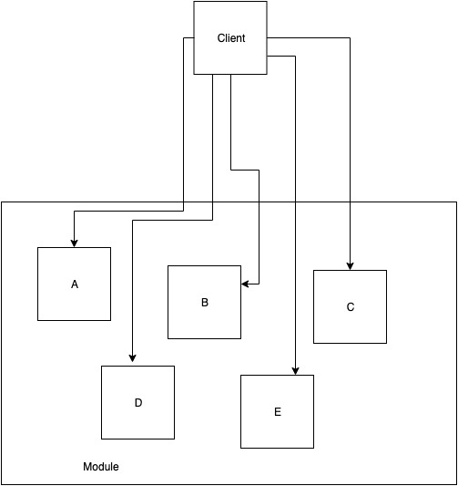
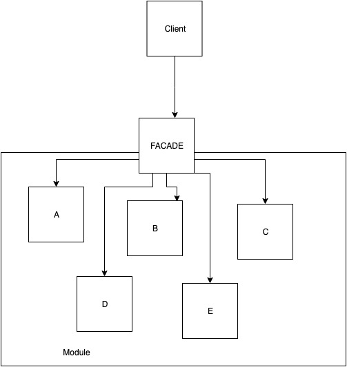

In this post, we'll quickly go through another structural design pattern - Facade.

According to Gang of Four definition, facade provides a simplified interface for a set of interfaces of a subsystem. It defines a convenient higher-level interface to interact with.

The facade decouples clients from subinterfaces of our modules. The client uses just one object - the facade, to delegate work to many separated components. The client doesn't have to know the details of our architecture - it is all hidden behind a clean interface of the facade.

## When to use?
- when you want to provide an easy interface to interact with a more complicated system
- to decouple the clients from implementation details
- to use as an entry point to some submodule

## Structure comparison

### Without Facade



The client knows the elements of module and orchestrates the work.

---
### With Facade



The client doesn't know anything about subsystem, it communicates with the facade only.
## Elements
- Facade - knows subsystem, orchestrates work, delegates requests to module components
- Submodule Class - elements of our module
- Client - uses facade to interact with the system

## Example implementation
Let's pretend that we're working on an e-commerce application. We want to implement product ordering.
We already got a few services in our app, but they are not integrated.

```java
public interface InventoryService {
    boolean isAvailable(int productId);
    int order(int productId);
}

public interface ShipmentService {
    void shipTo(int userId, int productId);
}

public interface NotificationService {
    void notifyAboutOrder(int userId, int orderId);
    void notifyAboutIssue(int userId);
}
```
(For purposes of this simple example, all business models like user, product or order are represented as integer IDs.)
(Interface implementations are also skipped as they're irrelevant.)

With those building blocks, we want to provide an API to order a product.

```java
public interface OrderFacade {
    void order(int productId, int userId);
}
```

We don't want client code to interact with several services just to make an order, so we provide nice and clean facade.

Here's its implementation:
```java
public class DefaultOrderFacade implements OrderFacade {
    // Dependencies could be injected using Dependency Injection tool
    public DefaultOrderFacade(final InventoryService inventory, 
                              final NotificationService notifications, 
                              final ShipmentService shipments) {
        this.inventory = inventory;
        this.notifications = notifications;
        this.shipments = shipments;
    }

    private final InventoryService inventory;
    private final NotificationService notifications;
    private final ShipmentService shipments;

    @Override
    public void order(int productId, int userId) {
        if (inventory.isAvailable(productId)) {
            final int orderId = inventory.order(productId);
            shipments.shipTo(userId, productId);
            notifications.notifyAboutOrder(userId, orderId);
        } else {
            notifications.notifyAboutIssue(userId);
        }
    }
}
```

## Conclusions
The facade implementation is responsible for distributing the work among elements of our application.
The client is decoupled from specific implementations and have a nice entry point to the system.

In my opinion, this pattern is very nice, as it's very easy to implement and appears somewhat naturally in projects.
It's one of the most common patterns I saw in production apps I worked with (not counting patterns used in frameworks etc.).